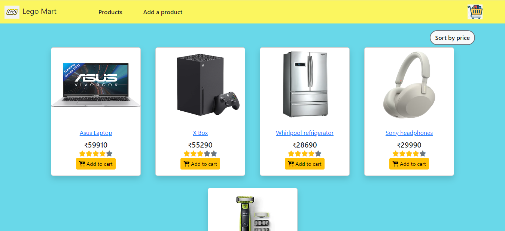

# lego Mart React App

This is an eCommerce project, which is built using React with redux to store data.

### Hosted link: [lego Mart](https://legomart.netlify.app/)



## Getting Started with the project

- Fork the project
- Clone the forked repository in your local system
- Run command to start the project
- Install all required packages

```bash
npm install
```

- Run project

```bash
npm start
```

## Functionality

- Add product
- Update product
- Delete product
- Add product to cart
- Remove the product from the cart
- Increase and decrease the quantity in the cart
- Sort products by price on the home page